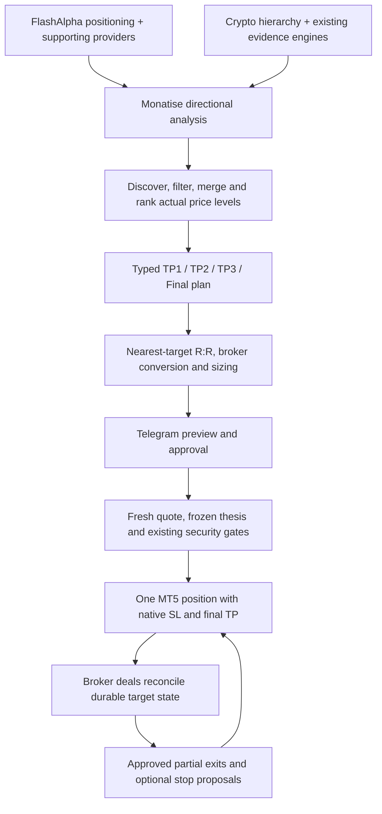

# Evidence-based multi-target take profit

Status: implemented behind disabled feature flags; requires staged broker/demo acceptance before production activation. This document describes the implementation, not a claim of live deployment or verified broker fills.

## Architecture and investigation

The implementation started from verified remote HEAD `f74fa5a755f7df8109142855e5098e9278d51f50` on 13 September 2026. The remote was checked rather than assuming the September 11 implementation was still current. That baseline passed a single `take_profit` through provider coordination, broker-relative mapping, Telegram preview, fresh-price approval, signed bridge command and one native position TP.

Monatise owns direction, qualification, ranking, sizing and management. FlashAlpha, Alpaca, Quiver, Finnhub and CoinGlass supply evidence. None receives execution authority from this change.

One position is used in both netting and hedging modes. The server sends bounded, signed partial-close intents through the existing bridge. The EA supplies the position ticket, identifier and symbol, verifies ownership and remaining volume, and sends the opposite deal for a strictly smaller volume. It does not open independent child positions. Native final TP and SL protect the position when the orchestration service is unavailable.

### Consumers and migration boundaries

| Boundary | Change / compatibility |
|---|---|
| FlashAlpha adapter | Retains real secondary strike/positioning fields; primary provider hierarchy unchanged. |
| Stock/futures coordinators and scanners | Shared target builder after existing directional qualification; per-asset gates. |
| Crypto hierarchy evaluator/service | Targets from all available finalized layers; TP1 qualifies the evidence bundle; structured publication carries the ladder. |
| On-demand, scheduled and dynamic crypto output | Same target-evidence adapter consumes existing directional engine outputs; no grid promotion or synthetic target passthrough when enabled. |
| Telegram normalization / preview / quote handoff | Carries the typed ladder intact, including provenance, policy and expiry. |
| FTMO proposal creation / approval / limit replacement | Validates, maps and sizes every target, freezes preview thesis, preserves origin levels for a replacement. |
| Signed command / EA | Carries full plan plus flat target prices/volumes for native validation. |
| Heartbeat / broker acknowledgements | Includes deal history and position identifiers; reconciles target fills and mutations durably. |
| Legacy `target`, `take_profit`, broker TP | Last available target. A one-target plan exits 100% there. Missing TP slots remain absent; no duplicate placeholders. |
| Legacy standalone strategy, paper/backtest and historical consumers | Continue accepting their existing scalar fields. No retroactive migration of historical trades. |

Existing single-TP proposals and positions are unchanged. New positions are managed only if they originate from an approved typed plan. A malformed enabled plan is rejected; it does not silently fall back to a scalar target. Unavailable secondary levels can naturally yield one or two valid targets.

## Evidence and ranking

FlashAlpha candidates include call/put walls, gamma flip, maximum positive/negative gamma strikes, highest-OI strike and the 0DTE magnet when returned. Explicit returned support, resistance and gamma-level lists are supported. Actual confirmed Alpaca pivots and completed-candle session extremes add technical destinations. Quiver/Finnhub remain contextual contributors through the existing coordinators; scalar sentiment, flow totals and analyst context are not guessed into prices.

Crypto candidates use the existing liquidity pools, swing highs/lows, opposing supply/demand boundaries and Fibonacci Liquidity Engine extensions at 1.272, 1.414 and 1.618. Extensions require engine-reported liquidity, zone or structure confluence. The hierarchy supplies available 1m/5m/15m/1h/4h evidence; older on-demand routes supply their available directional engine outputs. Aggregate OI, CVD, liquidations and whale metrics continue contributing through existing analysis; they are not falsely treated as price-resolved clusters. Additional price-resolved institutional destinations can use `TargetCandidate` when an integrated provider actually supplies them. Crypto has no FlashAlpha dependency.

Direction and freshness are hard filters. Non-finite, stale/future, weak, wrong-side or excessive-distance levels are excluded. Candidates normally expire after five hours of evidence age; confirmed structure for stop management has a separate five-minute ceiling. The default mapping-distance bound is 25% from analysis entry. Mapping of analysis to broker entry is independently constrained to a ratio of 0.5–2.0 and the verified instrument registry.

Levels within two ticks or the configured minimum incremental R are merged at the nearer price. Confluence retains provider/type/price context. Repeated levels from one provider do not earn independent-provider credit. The nearest credible objective is mandatory. Remaining destinations are ranked by structural relevance, confidence, liquidity significance, higher-timeframe relevance, independent provider agreement, freshness, reward and intervening opposing positioning. Distance resolves ties. Up to four selected levels are ordered in trade direction.

The explicit qualification policy is `REJECT_WEAK_FIRST_OBJECTIVE`: if TP1 is below the configured minimum (default 1.5R), reject. Do not skip it, rename it a checkpoint, or manufacture a farther price. Each later level must add at least 0.1R by default. Provider-confidence defaults are Monatise heuristic evidence weights, not claimed probabilities from providers. Stock scoring can gain one point for independent confluence; target count alone earns none.

## Plan, allocation and accounting

`TakeProfitTarget` stores name, analysis and broker prices, R, allocation, provider/source/evidence type, confidence, timeframe/observation time, allocated/closed volume, status, hit time and realized net P&L. `TakeProfitPlan` stores direction, entry/stop, targets, management mode, BE/trailing policies, volume, timestamps, qualification policy and schema version 1. Decimals cross the wire as strings. Parsing validates geometry, ordering, provenance, allocations and lifecycle quantities.

Defaults are 25/25/25/25. Four positive configured percentages must total 100. Fewer targets normalize the first N configured weights to 100. Volume is rounded down to the broker step for intermediate exits; all remainder is assigned to the last target. Each tranche and remainder must satisfy minimum lot and step rules. Tiny positions that cannot support the ladder are rejected, never rounded up beyond risk. Telegram shows planned percentages and actual lots after rounding.

`blended_expected_rr` is planned allocation-weighted R, using actual allocated volumes after sizing. It is not probability-weighted expectancy or a profit forecast. `maximum_available_rr` is the farthest selected target's R. Actual realized blended R uses net broker P&L divided by original estimated cash risk, adjusted for the opening fill price. Opening commission/fees and closing profit/commission/swap/fees are recorded; opening costs are proportionally attributed to target fills.

## Durable lifecycle and database

No new SQL DDL or destructive migration is required. Existing `monatise_application_documents` JSONB/CAS storage and audit streams hold new versioned namespaces:

| Namespace | Key / content |
|---|---|
| `hierarchy_target_plans_v1` | Evidence bundle ID; analysis ladder and management structure. |
| `ftmo_position_management_v1` | Original proposal/logical trade ID; immutable original plan, current plan, entry/SLs, original/remaining volume, per-target fills, P&L, MFE/MAE, seen deal IDs, event history and pending intent. |
| `ftmo_management_structure_v1` | Broker symbol; fresh confirmed structure, original analysis evidence and conversion ratio/quote timestamp. |
| Existing proposal, signal, analysis and command namespaces | Full typed plan, approval lineage, signed partial intent, conversion and policy data. |

Price crossing means pending, never filled. Unique broker deal IDs are the accounting authority. Targets move from `PENDING` to `PARTIAL_FILL` or `HIT`; the logical state records target pending/hit, management failure/pause, reconciliation requirement or `POSITION_CLOSED`. Terminal reasons distinguish SL, breakeven SL, native final TP and manual closure. Broker final TP can close an entire residual after a gap: skipped intermediate targets are `BYPASSED`, not falsely counted as hits.

The full pending proposal is reserved under a compare-and-swap state version before publication. Recovery recreates the same proposal ID after a crash between those writes. Duplicate deals and intents are idempotent. Lost acknowledgements can be resolved from matching broker order/comment evidence. Uncertain or partial submissions are never retried as a new order. A definitive rejection pauses automatic management; an explicit approved manual action can resume. A still-uncertain submission must reconcile first.

Opening and closing deals can reconstruct a trade that completed between heartbeats. A partially filled opening, missing closing history, unexpected scale-in/reversal or volume mismatch pauses management. Redis is not authoritative: a real test restarts PostgreSQL and Redis, discards the Redis cache and reconstructs a partially completed ladder plus its pending reservation.

Original setup expiry blocks entry and approval. After entry it does not close the trade or cancel its management lifecycle. Each management proposal has its own deadline. Reconciliation uses broker position identifiers, including ticket changes.

## Approval, EA and Telegram

The new EA version is 1.18. `InpMultiTPEnabled=false` by default; the bridge advertises capability version 1 only when enabled. It exports up to 1,024 deal rows: complete history for open owned positions up to the transport bound plus recent 30-day history. Missing evidence fails closed. This transport is deliberately bounded; high deal counts or long outages require reconciliation rather than invented fills.

Every sensitive operation retains authorized Telegram identity, approval, signed intent, replay journal, account identity, execution/master/arm gates, kill switch and broker validation. Approval rechecks fresh Bid/Ask, spread, market session, risk limits, all targets and stop/tick/freeze distances. Destinations stay fixed after preview; moved prices only recompute R and can reduce size. A materially damaged ladder returns `PRICE_MOVED_BEYOND_VALIDATION` or stale-setup rejection. Entry-to-broker relative conversion applies independently to every target and management structure, including GC→XAUUSD, ES→US500.cash and NQ→US100.cash.

EA partial requests specify `MqlTradeRequest.position`, symbol, magic, direction and bounded volume, run `OrderCheck`, and revalidate immediately before `OrderSend`. FOK is preferred, IOC supported; unsupported filling modes are rejected. No partial is sent after the native final target has already been reached. Partial fills require deal reconciliation. Native account-mode behavior and simultaneous stop/TP races still require demo acceptance on the intended FTMO server; compilation and simulations cannot certify broker behavior.

Previews show TP1/TP2/TP3/Final where present, R, planned percentages, executable lots, source types/providers, stop, risk and expiry. Manual target modifications show the complete proposed ladder before approval. Commands:

- `/targets TICKET` and `/management TICKET`: state, targets, fills, volume, P&L and stop policies.
- `/tp1`, `/tp2`, `/tp3`, `/finaltp TICKET PRICE`: modify an unfilled existing target with fresh validation and approval.
- `/tp TICKET PRICE`: compatibility override of the last available target for a managed position.
- `/sl`, `/breakeven`, `/close`: existing approval flow, durable state changes only after broker confirmation.

Default `APPROVAL_PER_EXIT` requires a fresh Telegram approval for each intermediate partial exit. If `AUTO_PARTIAL_CLOSE_ENABLED=true` before the original plan is created, `APPROVED_PLAN` includes the exact bounded exit schedule in the original preview. Subsequent partials reuse the approved scope through the existing authorization/signing gates. Disabling its route or automatic gate blocks queued automatic delivery.

Breakeven modes: `NONE`, `AFTER_TP1`, `AFTER_TP2`, `STRUCTURE_BASED`. Trailing modes: `OFF`, `STRUCTURE_TRAIL`, `ATR_TRAIL`, `LIQUIDITY_TRAIL`. Fresh, aligned, uninvalidated structure and broker distance are required; stops cannot worsen. Trailing starts after TP2. In version 1, the BE/trailing flags enable generation of protective proposals; each still requires separate Telegram approval. They do not silently change stops. This conservative approval choice is explicit.

## Rollout and rollback

Use `deploy/multi-tp.env.example`. All nine server flags are false by default: global, five asset routes, automatic partials, automatic BE and automatic trailing. The separate EA input is also false. A `MONATISE_` prefix is accepted for server parameters; a bare key takes precedence if both exist. Do not set conflicting aliases.

1. Deploy code with every new gate disabled. Existing single-TP behavior continues.
2. Enable global + one route in an isolated analysis/demo environment, with auto flags off. Review real provider ladders, source freshness, blocked weak TP1 examples and mapping.
3. Run EA 1.18 on the intended demo account with its local input enabled. Verify netting/hedging mode, volume/filling rules, stop/freeze distances, gap handling, manual/SL races, loss of connectivity, restarts and complete deal recovery. The code does not assume multiple positions per symbol.
4. Use per-exit approvals first. Enable automatic partial scope only through explicit deployment configuration after broker acceptance. BE/trailing remain separately approved proposals.
5. Expand routes gradually after reviewing logs, allocations, latency and broker results.

For rollback, disable new plan generation and automatic partial gates first. Preserve server accounting and EA history reporting while managed positions exist; keep native SL/final TP. Reconcile or explicitly manage open positions before downgrading the EA or disabling its capability input. Never delete pending records to resolve an uncertain fill.

## Observability, validation and limits

Candidate generation, exclusions, merging, final plan, provenance and broker conversion are logged. Durable logical trade events record opening costs, pending partials, fills/failures, manual/stop changes and final result. Proposal/command lineage links the same original trade across execution. MFE/MAE are heartbeat samples, not tick-perfect extrema. Stored stop events, original/current targets and per-source fills support later TP hit-rate and BE-effectiveness studies; no self-modifying learning logic was added.

Tests include both directions, one–four targets, poor nearest-R rejection, duplicate confluence, scalar/malformed/missing provider data, provider disagreement, all three futures→CFD mappings, real crypto engines and Fibonacci confluence, allocation profiles, tiny lots, every target/SL/BE lifecycle, approval/security/replay gates, rejection and lost ack, frozen thesis, manual overrides and command dispatch, conversion of protective structure, state-reservation crash recovery, opening/closing between heartbeats, and actual PostgreSQL/Redis process restarts. Existing coverage is retained. The EA was also compiled with native MetaEditor and its portable validation header executed under C++ assertions.

Local validation on 13 September 2026: **1,289 tests passed, zero failures and zero skips**, including **90 new cases**. PostgreSQL and Redis integration tests were enabled. MetaEditor compiled EA 1.18 with **zero errors and zero warnings**; Ruff F/E9 checks on the new Python modules/tests and `git diff --check` passed. No brokerage orders were submitted by these checks.

Limits before activation: no live or demo orders were submitted during development; provider weights and target profitability are not calibrated claims; final TP may bypass earlier tranches in a gap/outage; partial exits depend on bridge latency and spread at delivery; truncated deal history and uncertain fills pause automation. The initial implementation supports price-resolved evidence already present in the repository, not imaginary liquidation/OI price maps.

### Primary references

- [FlashAlpha Lab API levels](https://flashalpha.com/docs/lab-api-levels): documented positioning strike fields.
- [MQL5 full and partial closing](https://www.mql5.com/en/book/automation/experts/experts_close): netting/hedging request fields and partial-close mechanics.
- [MQL5 trade request](https://www.mql5.com/en/docs/constants/structures/mqltraderequest): position-bound requests and broker operations.
- [MQL5 trade return codes](https://www.mql5.com/en/docs/constants/errorswarnings/enum_trade_return_codes): definitive rejection and closed/invalid-volume responses.
- [MetaEditor compiler integration](https://www.metatrader5.com/en/metaeditor/help/beginning/integration_ide): native compiler verification.
